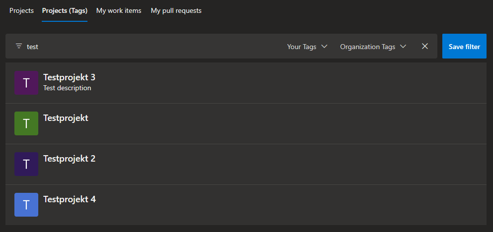
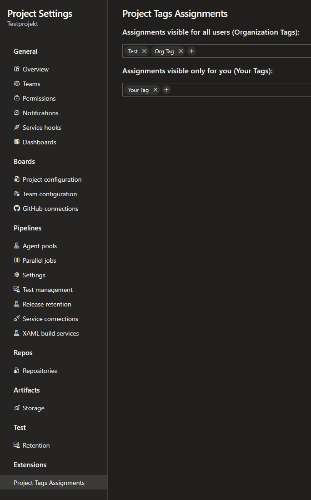

# Project management with Tags - Azure DevOps Extension
_Tags for Projects_ is an Azure DevOps Extension which enables filtering projects by custom tags.

With a growing number of projects in your Azure DevOps organization, finding them quickly in the Projects View on the organization home page becomes harder.

This extension tries to solve this by allowing to assign tags to projects and filter the project list with tags.

## Install
The extension can be installed from the [marketplace](https://marketplace.visualstudio.com/items?itemName=MichaelKahle.tags-for-projects).

It required the "Project and team (read)" permission to get all projects of the user.
Assigned tags are saved as extension settings.
If the images in the project list don't load you might need to allow third-party cookies for dev.azure.com in your browser.

## How to use
Two types of tags are supported:
- User Tags: visible only to the user who assigned them to projects
- Organization Tags: visible to all users in the organization

### Filtering projects
The extension adds a tab "Projects (Tabs)" to the home page of the organization.

You can use the filterbar to filter the projects by name, user tags or organization tags.

The "Save filter" button saves the current filter which will then be applied everytime you open or reload the "Projects (Tags)" tab.

### Assigning tags to projects
Tags can be assigned to projects in the project settings:

## Contributing

Feedback, ideas, and contributions are welcome. If you discover a bug, have a suggestion, or miss a feature, please open an issue.

## License

This extension is licensed under the [MIT](LICENSE) license.